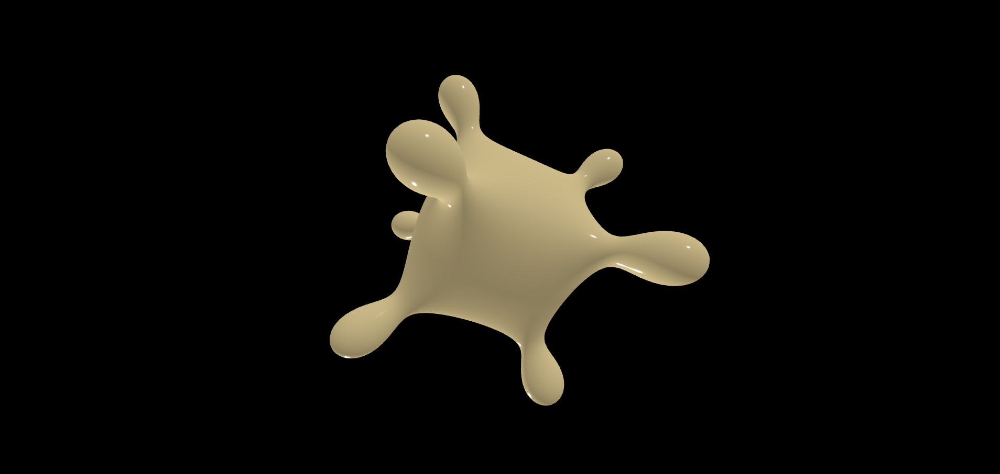
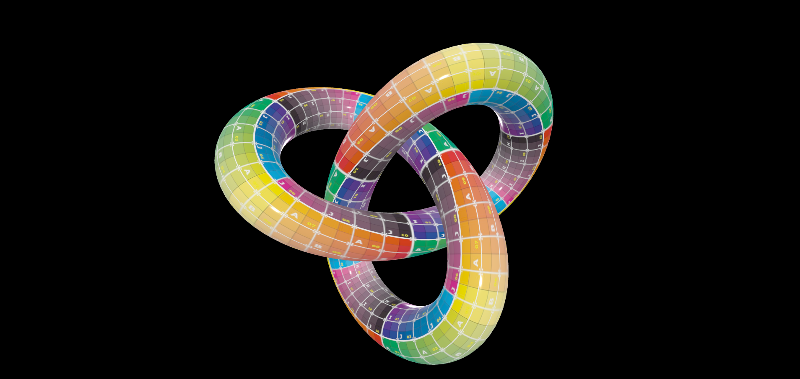
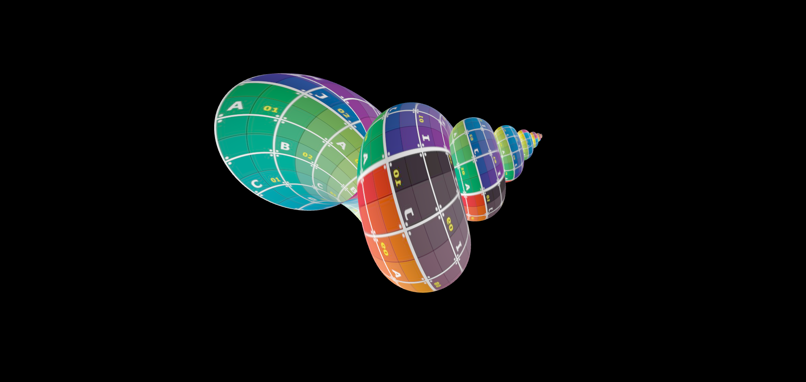

# Setup

npm install --save

## Dev

npm run dev

## Build

npm run build

## Technical considerations

Creates meshes THREE.js for parametric surfaces and implicit surfaces.

CurveGeometry - class for generating geometry of parametric curve

SurfGeometry - class for generating geometry of parametric surface

ImplicitGeometry - class for generating geometry of implicit surface. Implementation of the Marching Cubes Algorithm in 3d and binary find with n iterations

Demo: https://flightphone.github.io/geometry/index.html

